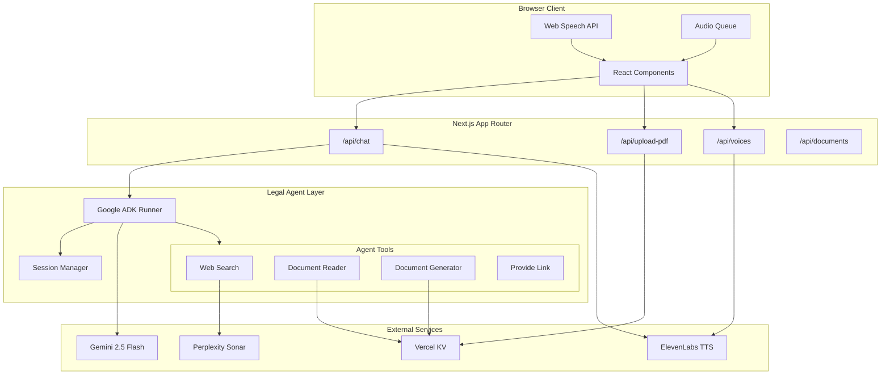
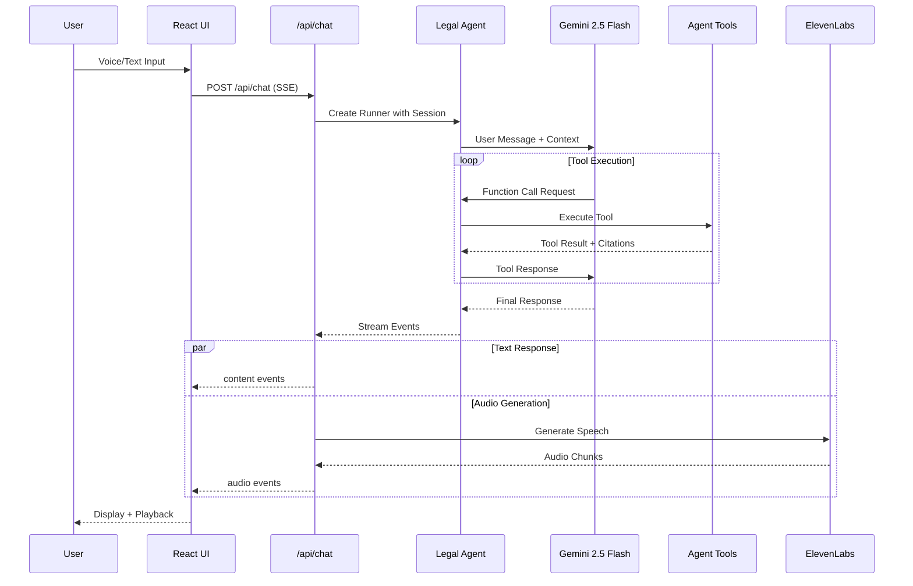
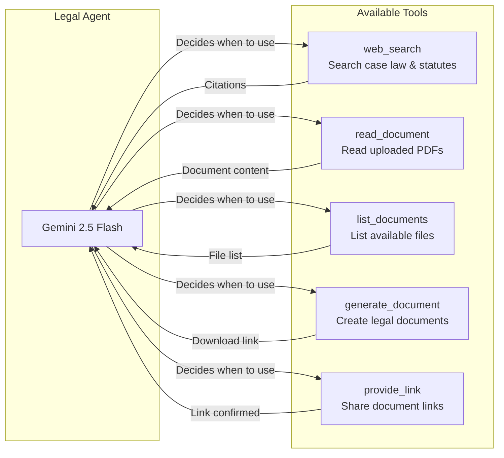
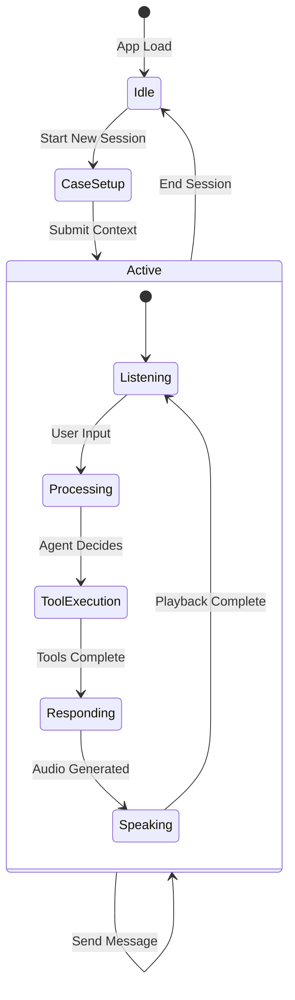

# Moot


**AI-powered legal practice platform for moot court preparation, case analysis, and oral argument training.**

Moot transforms legal education and trial preparation by providing an intelligent conversational AI that can role-play as opposing counsel, judges, witnesses, or mentors. Users practice oral arguments, research case law, analyze uploaded legal documents, and generate professional legal documents - all through natural voice or text interaction.

---

## Problem Statement

Law students and legal professionals face significant challenges in preparing for moot court competitions and oral arguments:

- **Limited Access to Practice Partners**: Finding qualified individuals to simulate opposing counsel or judicial questioning is difficult and expensive
- **Inconsistent Feedback Quality**: Practice sessions often lack the rigor and legal accuracy needed for effective preparation
- **Research Fragmentation**: Legal research, document analysis, and argument preparation happen across disconnected tools
- **No Voice-Based Training**: Real courtroom advocacy requires verbal articulation, yet most preparation is text-based

Moot addresses these challenges by providing an always-available AI legal practice partner with genuine research capabilities and voice-first interaction.

---

## Core Features

### Adaptive AI Personas

The AI dynamically assumes different courtroom roles based on session configuration:

| Persona | Behavior |
|---------|----------|
| **Legal Assistant** | Helpful guide for research and case preparation |
| **Opposing Counsel** | Adversarial role-player who challenges arguments with cited case law |
| **Judge** | Neutral arbiter demanding citations and evaluating argument merit |
| **Witness** | Role-play witness examination with responsive, cautious answers |
| **Mentor** | Experienced guide providing strategic feedback and coaching |

### Voice-First Interaction

Real-time bidirectional voice communication powered by ElevenLabs text-to-speech and Web Speech API for speech recognition. The system manages audio state to prevent feedback loops during AI responses.

### Integrated Legal Research

Live case law and statute search through Perplexity Sonar API with automatic citation extraction. Results are formatted for voice delivery while maintaining source attribution in a dedicated citations panel.

### Document Intelligence

- **PDF Upload and Analysis**: Extract and analyze content from uploaded legal documents
- **Document Generation**: Create memos, briefs, summaries, outlines, contract drafts, and letters as downloadable PDFs
- **Session-Scoped Storage**: Documents are isolated per session with Vercel KV in production or file-based storage locally

---

## Architecture



---

## Request Flow



---

## Technology Stack

### Frontend

| Technology | Purpose |
|------------|---------|
| **Next.js 16** | React framework with App Router |
| **TypeScript** | Type-safe development |
| **Tailwind CSS 4** | Utility-first styling |
| **Lucide React** | Icon system |
| **Motion** | Animation library |
| **Web Speech API** | Browser-native speech recognition |

### Backend / AI

| Technology | Purpose |
|------------|---------|
| **Google ADK** | Agent Development Kit for tool orchestration |
| **Gemini 2.5 Flash** | Large language model for reasoning and generation |
| **ElevenLabs** | Text-to-speech with streaming audio |
| **Perplexity Sonar** | Web search with citations for legal research |

### Infrastructure

| Technology | Purpose |
|------------|---------|
| **Vercel** | Deployment and edge functions |
| **Vercel KV** | Redis-based document persistence |
| **jsPDF** | PDF document generation |
| **unpdf / pdf-parse** | PDF text extraction |

---

## Agent Tool System

The Legal Agent uses Google ADK's FunctionTool abstraction to provide structured capabilities:



### Tool Descriptions

| Tool | Description |
|------|-------------|
| `web_search` | Queries Perplexity Sonar for legal cases, statutes, and precedents. Includes domain filtering for legal-specific sources. |
| `read_document` | Retrieves content from session-scoped uploaded documents. Supports section extraction. |
| `list_documents` | Returns available documents in the current session for the agent to reference. |
| `generate_document` | Creates formatted legal documents (memo, brief, summary, outline, contract draft, letter) as PDFs. |
| `provide_link` | Adds generated documents to the citations panel for user access. |

---

## Session Management

Sessions maintain conversation history and document context through Google ADK's InMemorySessionService:



### Case Context Flow

1. **Case Setup**: User defines case type, difficulty, AI persona, and uploads documents
2. **Document Staging**: Files upload to a "staging" session during setup
3. **Session Creation**: On first message, a session ID is generated and documents are moved from staging
4. **Context Injection**: Case context is prepended to the first message with persona instructions
5. **Conversation Continuity**: Subsequent messages use the stored session ID for history

---

## Project Structure

```
moot/
├── app/
│   ├── api/
│   │   ├── chat/           # Streaming chat endpoint with SSE
│   │   ├── documents/      # Document download endpoint
│   │   ├── upload-pdf/     # PDF upload and extraction
│   │   ├── move-documents/ # Document session transfer
│   │   └── voices/         # ElevenLabs voice listing
│   ├── chat/
│   │   └── page.tsx        # Main chat interface
│   ├── components/
│   │   ├── CaseSetup.tsx       # Session configuration form
│   │   ├── ChatSection.tsx     # Message display
│   │   ├── ChatInput.tsx       # Text input with file upload
│   │   ├── VoiceControl.tsx    # Voice mode visualization
│   │   ├── CitationsPanel.tsx  # Sources and generated docs
│   │   └── Sidebar.tsx         # Navigation and settings
│   ├── hooks/
│   │   ├── useWebSpeech.ts     # Speech recognition hook
│   │   └── useAudioQueue.ts    # Audio playback management
│   ├── lib/
│   │   ├── agent/
│   │   │   └── legal-agent.ts  # ADK agent configuration
│   │   ├── tools/
│   │   │   ├── web-search.ts       # Perplexity integration
│   │   │   ├── document-reader.ts  # PDF content access
│   │   │   ├── document-generator.ts # PDF creation
│   │   │   └── provide-link.ts     # Citation management
│   │   └── services/
│   │       └── voice-service.ts    # ElevenLabs TTS
│   └── page.tsx            # Landing page
└── public/
    └── moot_logo.svg       # Application branding
```

---

## Environment Variables

| Variable | Required | Description |
|----------|----------|-------------|
| `GOOGLE_API_KEY` | Yes | Gemini API access |
| `ELEVENLABS_API_KEY` | No | Voice synthesis (voice features disabled without) |
| `PERPLEXITY_API_KEY` | No | Web search (falls back to mock results) |
| `KV_REST_API_URL` | No | Vercel KV connection (uses file storage locally) |
| `KV_REST_API_TOKEN` | No | Vercel KV authentication |

---

## Getting Started

### Prerequisites

- Node.js 18+
- pnpm (recommended) or npm

### Installation

```bash
cd moot

# Install dependencies
pnpm install

# Copy environment template
cp .env.local.example .env.local

# Add your API keys to .env.local
```

### Development

```bash
pnpm dev
```

Open [http://localhost:3000](http://localhost:3000) to access the application.

### Production Build

```bash
pnpm build
pnpm start
```

---

## Deployment

The application is optimized for Vercel deployment:

1. Connect repository to Vercel
2. Configure environment variables in Vercel dashboard
3. Enable Vercel KV for document persistence
4. Deploy

Edge functions handle the streaming chat endpoint for optimal latency.
